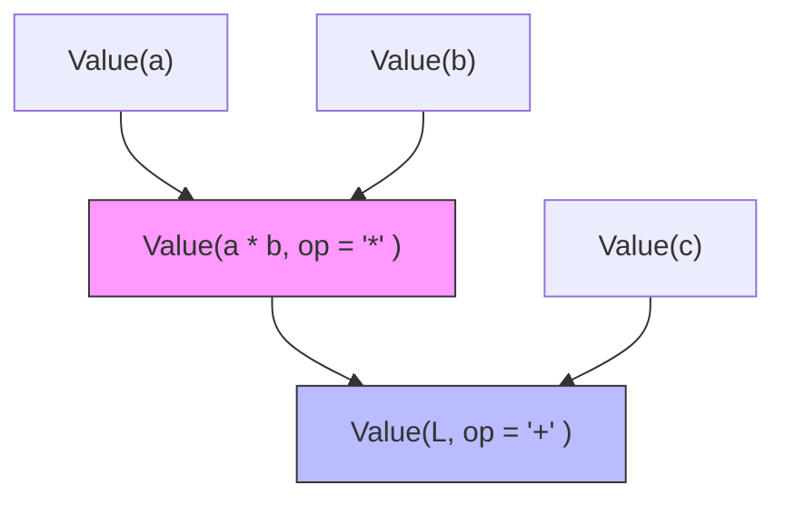
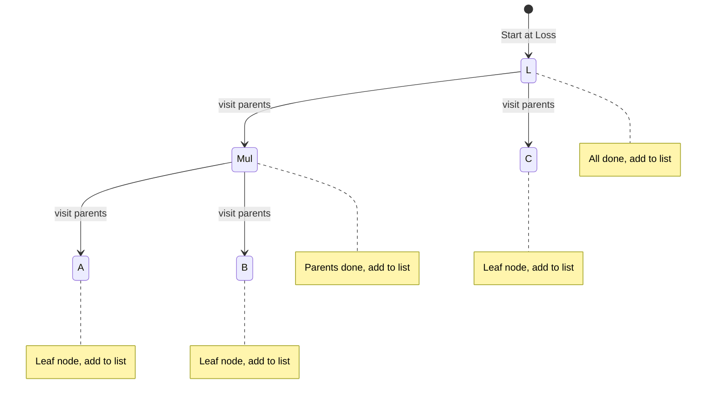
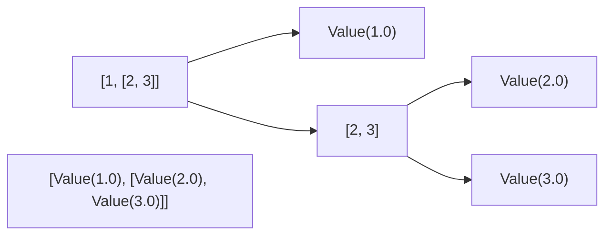
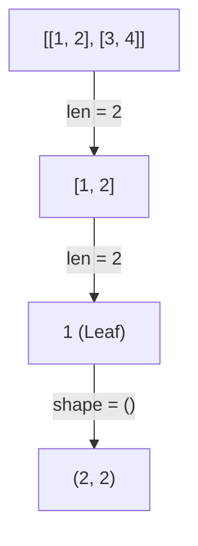
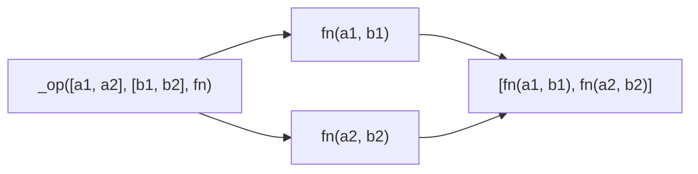
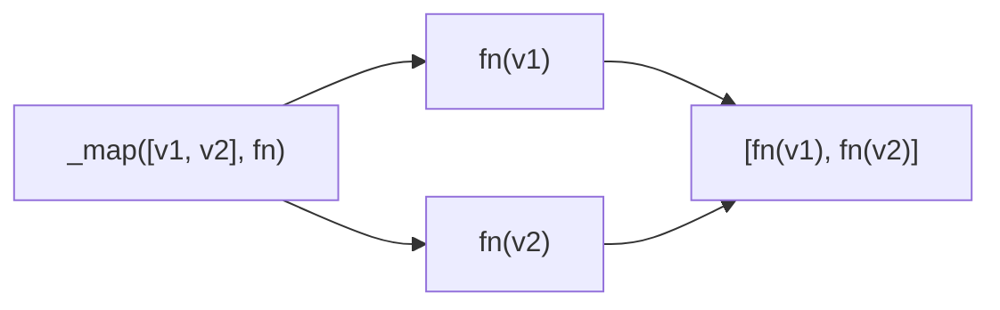

# Theory of GradFlow

## 1. The Computation Graph

The engine represents mathematical expressions as a Directed Acyclic Graph (DAG). 

### Node Structure
Every `Value` object is a node in this graph.
- `data`: The scalar value computed in the forward pass.
- `grad`: The derivative $\frac{\partial L}{\partial \text{this node}}$.
- `_parents`: Set of parent nodes (dependencies).
- `_op`: The operation that produced this node.

### Example: `L = (a * b) + c`
The forward pass builds the following structure:



## 2. Gradient Flow (Backpropagation)

The goal is to calculate how the final output `L` changes with respect to any input node $x$.

### The Chain Rule
For any node $z$ created by an operation on $x$ (i.e., $z = f(x)$), the gradient $\frac{\partial L}{\partial x}$ is:
$$\frac{\partial L}{\partial x} = \frac{\partial L}{\partial z} \cdot \frac{\partial z}{\partial x}$$

In `engine.py`, each node $z$ has a `_backward()` closure that implements this:
```python
# For z = x * y
def _backward():
    x.grad += y.data * z.grad  # dL/dx = (dz/dx) * dL/dz
    y.grad += x.data * z.grad  # dL/dy = (dz/dy) * dL/dz
```

### Why Accumulate (`+=`)?
If a variable $x$ flows into multiple nodes (e.g., $y = x^2$ and $z = 3x$), the total gradient is the sum of all paths (Multivariate Chain Rule):
$$\frac{\partial L}{\partial x} = \frac{\partial L}{\partial y}\frac{\partial y}{\partial x} + \frac{\partial L}{\partial z}\frac{\partial z}{\partial x}$$

`self.grad += ...` ensures we sum these independent influences instead of overwriting them.

### Base Case: `dL/dL = 1`
When `backward()` is called, we set `loss.grad = 1`. This is because the derivative of any variable with respect to itself is 1. This "seed" allows the chain rule to propagate backwards.

## 3. Operation Mapping

| Op | Derivative ($\frac{\partial z}{\partial x}$) | `_backward` implementation |
| :--- | :--- | :--- |
| $z=x+y$ | $1$ | `x.grad += 1.0 * out.grad` |
| $z=xy$ | $y$ | `x.grad += y * out.grad` |
| $z=x^n$ | $n \cdot x^{n-1}$ | `x.grad += (n * x**(n-1)) * out.grad` |
| $z=\text{ReLU}(x)=\max(0,x)$ | $1$ if $x > 0$ else $0$ | `x.grad += (out.data > 0) * out.grad` |

## 4. Ordering (Topological Sort)

We cannot calculate the gradient of a node until we have the gradients of all nodes that depend on it.

### The Algorithm
`build_topo` uses a recursive DFS to order nodes such that for any edge $U \to V$, $U$ appears before $V$ in the list. To backpropagate, we reverse this list to process the graph from the output to the inputs.



**Final Topological Order:** `[a, b, mul, c, L]`  
**Backprop Order (Reversed):** `[L, c, mul, b, a]`

Executing `_backward()` in this reversed order guarantees that when we reach `mul`, `L.grad` is already set, and when we reach `a`, `mul.grad` is already fully computed.

## 5. Tensors

A `Tensor` is a wrapper mapping matrix operations down to a grid of individual `Value` nodes.

### 5.1 Initialization and Recursion

#### `_to_value_grid(data)`
Recursively wraps floats into `Value` objects to build the internal grid.

**Example**: `[1, [2, 3]]`


#### `_get_shape(data)`
Recursively discovers dimensions by traversing the "head" of each nested list level.

**Example**: `[[1, 2], [3, 4]]`


#### `_flatten(a)`
Flattens the nested grid into a 1D list of `Value` objects for aggregation.

```graph TD
    F["[[v1, v2], [v3, v4]]"] -- split --> F1["[v1, v2]"]
    F1 -- split --> v1["v1"]
    F1 -- split --> v2["v2"]
    F -- split --> F2["[v3, v4]"]
    F2 -- split --> v3["v3"]
    F2 -- split --> v4["v4"]
    v1 --> Res["[v1, v2, v3, v4]"]
    v2 --> Res
    v3 --> Res
    v4 --> Res
```

### 5.2 Dispatch Logic

These methods handle recursive traversal of the tensor grid to apply functions at the leaf (`Value`) level.

#### `_op(a, b, fn)`
Traverses two grids of identical shape and applies a binary function.
- **Used by**: `+`, `-` (via add/neg), `*` (element-wise), `/` (via mul/inv).
- **Example**: $[a1, a2] + [b1, b2] \rightarrow [a1+b1, a2+b2]$



#### `_map(a, fn)`
Traverses a single grid and applies a unary function.
- **Used by**: Scalar multiplication (`Tensor * 2.0`), activation functions (`ReLU`).
- **Example**: $[v1, v2] \cdot 2 \rightarrow [v1\cdot2, v2\cdot2]$



### 5.3 Matrix Operations

**Matrix Multiplication ($C = A \times B$):**
$$\begin{pmatrix} c_{11} & c_{12} \\ c_{21} & c_{22} \end{pmatrix} = \begin{pmatrix} a_{11} & a_{12} \\ a_{21} & a_{22} \end{pmatrix} \begin{pmatrix} b_{11} & b_{12} \\ b_{21} & b_{22} \end{pmatrix}$$

Each element is computed as: $c_{ij} = \sum_{k} a_{ik} \cdot b_{kj}$

Because this uses the `+` and `*` operators overloaded in `engine.py`, the resulting `Value` objects are **automatically tracked** in the computation graph.

### 5.4 Reductions and Backprop

#### `sum()` logic
The `sum()` operation flattens the tensor and adds every element.
$$L = \sum_i \text{flatten}(T_i)$$
This reduces the high-dimensional tensor to a single `Value` node representing the scalar loss.

#### Backpropagation Flow
1. **Starting Point**: `L.backward()` sets `L.grad = 1.0`.
2. **Reverse Flow**: Gradients propagate through the sum (distributing 1.0 to each element) and then through the operations (like MatMul) that formed those elements.
3. **Weight Updates**: Derivatives flow into the specific weights $a_{ik}$ and $b_{kj}$ that contributed to the output $c_{ij}$. This works because $c_{ij}$ is just a node in the scalar graph.

> [!NOTE]
> Backpropagation currently only supports scalar outputs. If the output were a vector or matrix, we would need to compute the Jacobian, which is not yet implemented.
