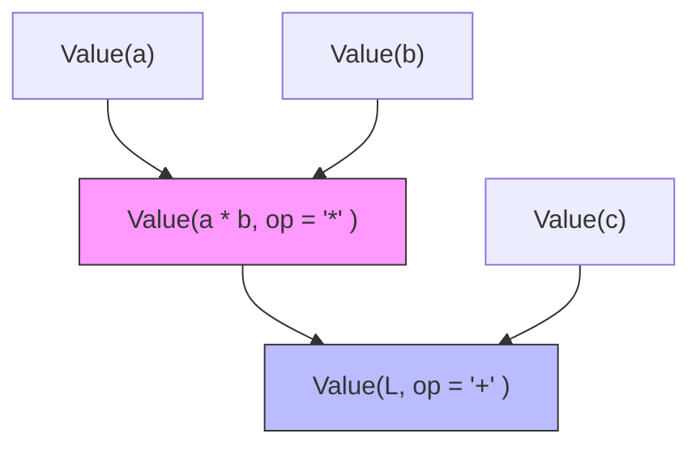
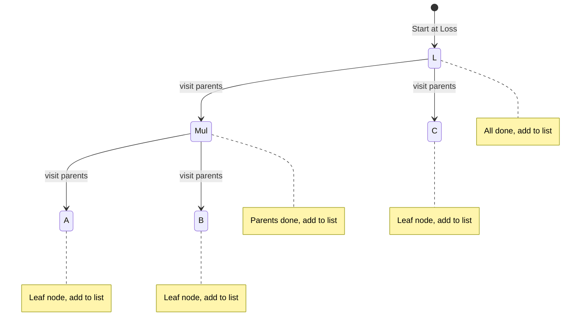

# Theory of GradFlow

## 1. The Computation Graph

The engine represents mathematical expressions as a Directed Acyclic Graph (DAG). 

### Node Structure
Every `Value` object is a node in this graph.
- `data`: The scalar value computed in the forward pass.
- `grad`: The derivative $\frac{\partial L}{\partial \text{this node}}$.
- `_parents`: Set of parent nodes (dependencies).
- `_op`: The operation that produced this node.

### Example: `L = (a * b) + c`
The forward pass builds the following structure:



## 2. Gradient Flow (Backpropagation)

The goal is to calculate how the final output `L` changes with respect to any input node $x$.

### The Chain Rule
For any node $z$ created by an operation on $x$ (i.e., $z = f(x)$), the gradient $\frac{\partial L}{\partial x}$ is:
$$\frac{\partial L}{\partial x} = \frac{\partial L}{\partial z} \cdot \frac{\partial z}{\partial x}$$

In `engine.py`, each node $z$ has a `_backward()` closure that implements this:
```python
# For z = x * y
def _backward():
    x.grad += y.data * z.grad  # dL/dx = (dz/dx) * dL/dz
    y.grad += x.data * z.grad  # dL/dy = (dz/dy) * dL/dz
```

### Why Accumulate (`+=`)?
If a variable $x$ flows into multiple nodes (e.g., $y = x^2$ and $z = 3x$), the total gradient is the sum of all paths (Multivariate Chain Rule):
$$\frac{\partial L}{\partial x} = \frac{\partial L}{\partial y}\frac{\partial y}{\partial x} + \frac{\partial L}{\partial z}\frac{\partial z}{\partial x}$$

`self.grad += ...` ensures we sum these independent influences instead of overwriting them.

### Base Case: `dL/dL = 1`
When `backward()` is called, we set `loss.grad = 1`. This is because the derivative of any variable with respect to itself is 1. This "seed" allows the chain rule to propagate backwards.

## 3. Operation Mapping

| Op | Derivative ($\frac{\partial z}{\partial x}$) | `_backward` implementation |
| :--- | :--- | :--- |
| $z=x+y$ | $1$ | `x.grad += 1.0 * out.grad` |
| $z=xy$ | $y$ | `x.grad += y * out.grad` |
| $z=x^n$ | $n \cdot x^{n-1}$ | `x.grad += (n * x**(n-1)) * out.grad` |
| $z=\text{ReLU}(x)=\max(0,x)$ | $1$ if $x > 0$ else $0$ | `x.grad += (out.data > 0) * out.grad` |

## 4. Ordering (Topological Sort)

We cannot calculate the gradient of a node until we have the gradients of all nodes that depend on it.

### The Algorithm
`build_topo` uses a recursive DFS to order nodes such that for any edge $U \to V$, $U$ appears before $V$ in the list. To backpropagate, we reverse this list to process the graph from the output to the inputs.



**Final Topological Order:** `[a, b, mul, c, L]`  
**Backprop Order (Reversed):** `[L, c, mul, b, a]`

Executing `_backward()` in this reversed order guarantees that when we reach `mul`, `L.grad` is already set, and when we reach `a`, `mul.grad` is already fully computed.
