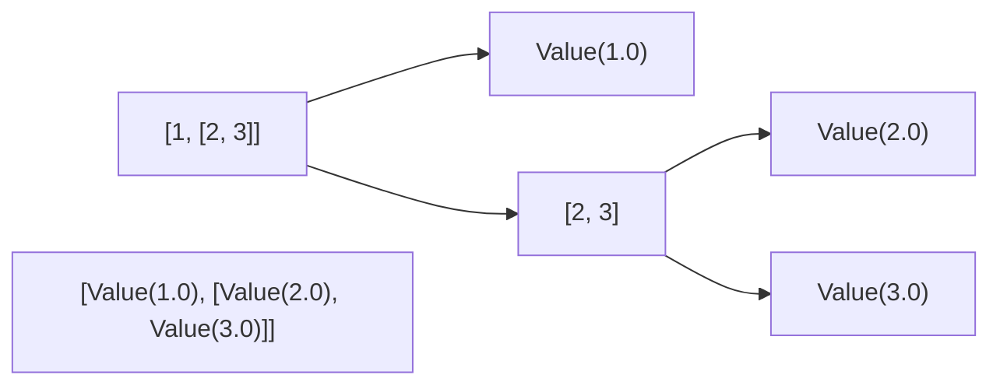
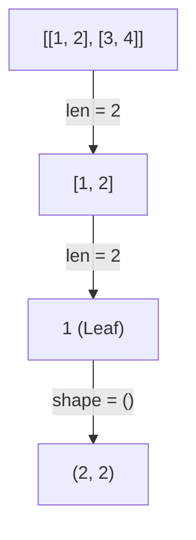
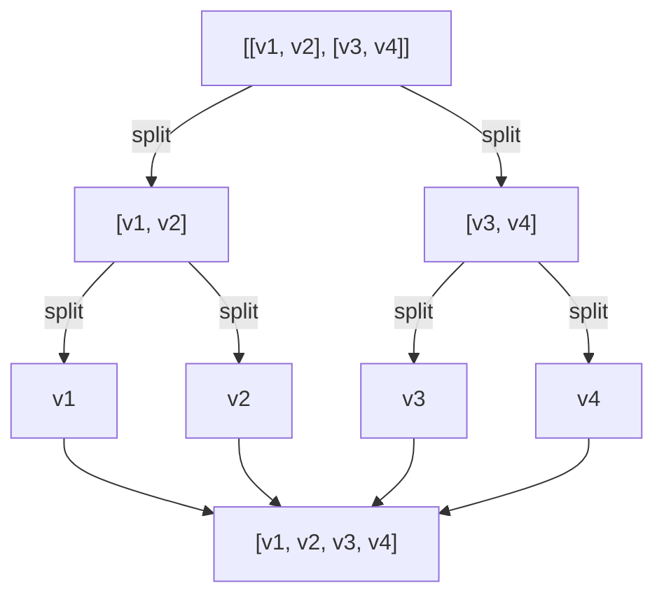
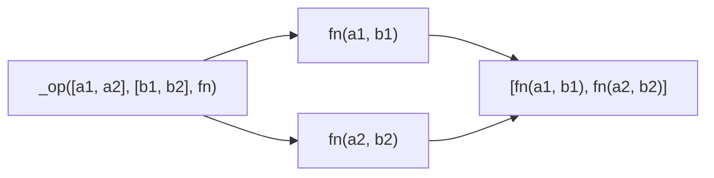
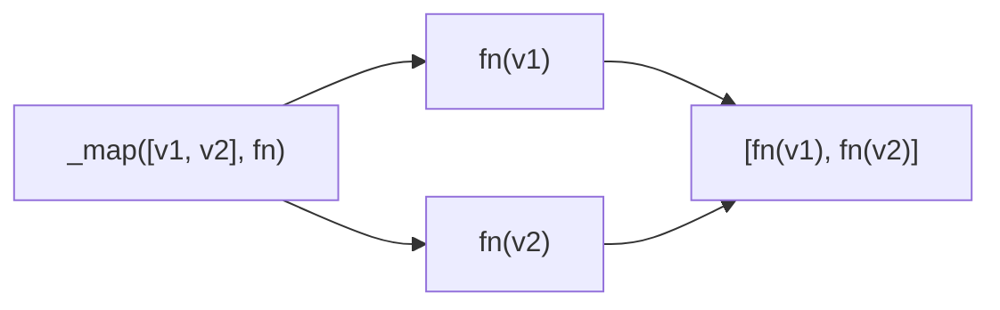

# Theory Chapter 2: Tensors

A `Tensor` is a wrapper mapping matrix operations down to a grid of individual `Value` nodes.

## 2.1 Initialization and Recursion

### `_to_value_grid(data)`
Recursively wraps floats into `Value` objects to build the internal grid.

**Example**: `[1, [2, 3]]`

### `_get_shape(data)`
Recursively discovers dimensions by traversing the "head" of each nested list level.

**Example**: `[[1, 2], [3, 4]]`

### `_flatten(a)`
Flattens the nested grid into a 1D list of `Value` objects for aggregation.

## 2.2 Dispatch Logic

These methods handle recursive traversal of the tensor grid to apply functions at the leaf (`Value`) level.

### `_op(a, b, fn)`
Traverses two grids of identical shape and applies a binary function.
- **Used by**: `sum`, `+`, `-` (via add/neg), `*` (element-wise), `/` (via mul/inv).
- **Example**: $[a1, a2] + [b1, b2] \rightarrow [a1+b1, a2+b2]$

### `_map(a, fn)`
Traverses a single grid and applies a unary function.
- **Used by**: Scalar multiplication (`Tensor * 2.0`), activation functions (`ReLU`).
- **Example**: $[v1, v2] \cdot 2 \rightarrow [v1\cdot2, v2\cdot2]$

## 2.3 Matrix Operations

**Matrix Multiplication ($C = A \times B$):**

$$
\pmatrix{ c_{11} & c_{12} \\\ c_{21} & c_{22} } = \pmatrix{ a_{11} & a_{12} \\\ a_{21} & a_{22} } \pmatrix{ b_{11} & b_{12} \\\ b_{21} & b_{22} }
$$

Each element is computed as: $c_{ij} = \sum_{k} a_{ik} \cdot b_{kj}$

Because this uses the `+` and `*` operators overloaded in `engine.py`, the resulting `Value` objects are **automatically tracked** in the computation graph.

## 2.4 Reductions and Backprop

### `sum()` logic
The `sum()` operation flattens the tensor and adds every element.

$$L = \sum_i \text{flatten}(T_i)$$

This reduces the high-dimensional tensor to a single `Value` node representing the scalar loss.

### Backpropagation Flow
1. **Starting Point**: `L.backward()` sets `L.grad = 1.0`.
2. **Reverse Flow**: Gradients propagate through the sum (distributing 1.0 to each element) and then through the operations (like MatMul) that formed those elements.
3. **Weight Updates**: Derivatives flow into the specific weights $a_{ik}$ and $b_{kj}$ that contributed to the output $c_{ij}$. This works because $c_{ij}$ is just a node in the scalar graph.

> [!NOTE]
> Backpropagation currently only supports scalar outputs. If the output were a vector or matrix, we would need to compute the Jacobian, which is not yet implemented.

