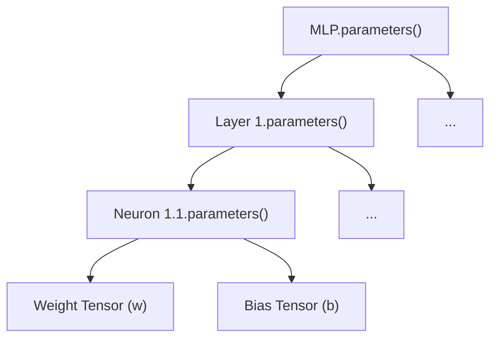

# Theory Chapter 3: Neural Network Components

The `nn` package builds a hierarchy from scalar values back up to multidimensional tensors.

## 3.1 `Neuron`
A neuron calculates a weighted sum of inputs and adds a bias.

**Forward Pass**: $out = \text{ReLU}(\sum_{i=1}^{n} w_i x_i + b)$

<picture>
  <source media="(prefers-color-scheme: dark)" srcset="https://github.com/user-attachments/assets/7a3b179e-9cf0-40ff-a41c-b153852fd868">
  <source media="(prefers-color-scheme: light)" srcset="https://github.com/user-attachments/assets/6797bf4d-05eb-4df3-a0a3-4b41e8a91749">
  
</picture>

<picture>
  <source media="(prefers-color-scheme: dark)" srcset="https://github.com/user-attachments/assets/a27b5e88-fc86-471d-8f35-111181e74f92">
  <source media="(prefers-color-scheme: light)" srcset="https://github.com/user-attachments/assets/1cc57535-328d-4244-a5d7-7fc75c3d9e3a">
  
</picture>

**Key Step**: The `.sum()` operation on the `Tensor` converts the multidimensional grid into a single `Value` node, which is then tracked by the engine.

**Parameters**: Each neuron stores its own weights (`w`) and bias (`b`) as learnable `Tensor` objects. The `parameters()` method returns `[self.w, self.b]`.

## 3.2 `Layer`
A layer is a collection of neurons processing the same input in parallel.

<picture>
  <source media="(prefers-color-scheme: dark)" srcset="https://github.com/user-attachments/assets/9f6db815-e877-4c1a-8faa-d9c9e8ee74eb">
  <source media="(prefers-color-scheme: light)" srcset="https://github.com/user-attachments/assets/1f43147c-e4e7-481b-8c5e-b94bbd3be5c4">
  
</picture>

- **Input**: `x` (Tensor)

- **Mechanism**: `[n1(x), n2(x), ...]`

- **Output**: Returns a `Tensor` wrapping the scalar `Value` outputs from each neuron.

- **Parameters**: Aggregates parameters from every neuron in the layer: `[parameter for n in self.neurons for parameter in n.parameters()]`.

## 3.3 `MLP`
A Multi-Layer Perceptron is a sequence of layers.

- **Mechanism**: `y = ...(L3(L2(L1(x))))`

- **Parameters**: Collected recursively through the hierarchy:

