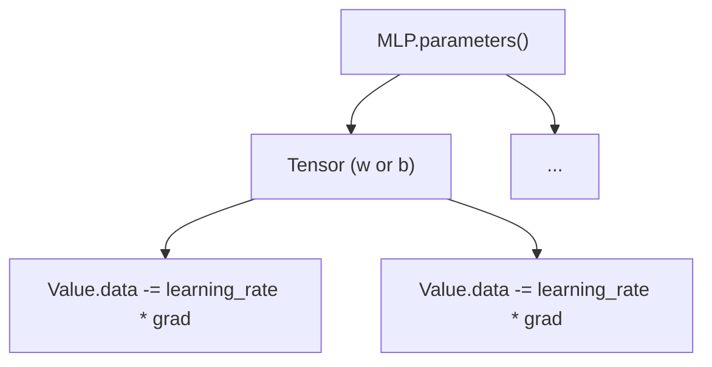

# Theory Chapter 5: Training Workflow (`demo.ipynb`)

A typical training iteration follows these concrete steps:

## 5.1 Data Processing
1. **Load**: `read_csv` returns `List[Dict]`.
2. **Format**: Features extracted to `features` (List of Lists), labels to `labels` (List of floats).
3. **Wrap**: Features are wrapped in `Tensor` during `model(x)`.

## 5.2 Loss and Backprop
1. **Forward**: `predictions = [model(x) for x in features]` (List of Tensors).
2. **MSE Loss**: $L = \frac{1}{n} \sum (prediction - y_{target})^2$. This produces a single `Value` node.
3. **Backward**: `loss.backward()` triggers:
   - Topological sort of the entire scalar graph.
   - Recursive call to every node's `_backward()` function.

## 5.3 Batch Gradient Descent Update
The model's `parameters()` method provides a flat list of all learnable Tensors. We iterate through this list to update the underlying `Value` objects using the Batch average:

$$Value.data = Value.data - \eta \cdot Value.grad$$

**Note**: We use `model.zero_grad()` at the start of each loop to reset `Value.grad = 0`, as gradients accumulate via `+=` in the engine.
